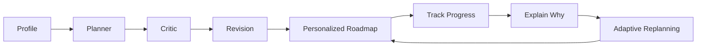
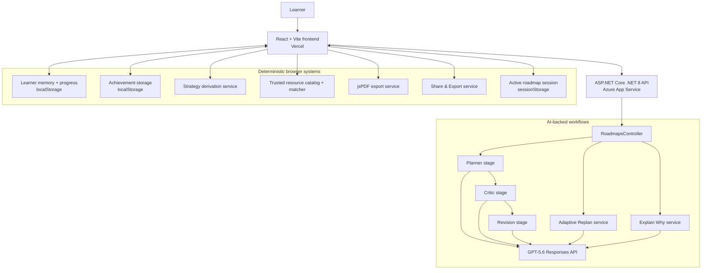
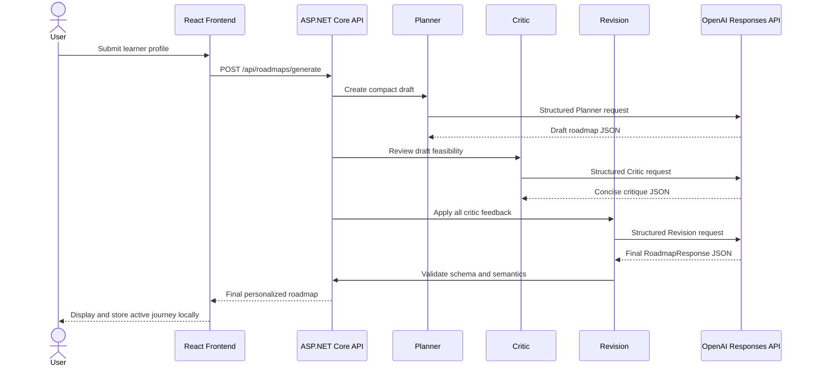
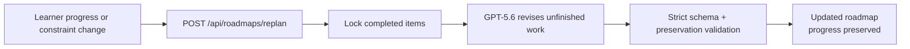

# PathPilot AI

> An adaptive AI learning coach that plans, critiques, explains, tracks, and replans personalized learning journeys.

**Plan with rigor. Learn with context. Adapt without losing progress.**

[Live demo](https://pathpilotaihackathon.vercel.app) · [Backend health](https://pathpilot-ai-api-2026-agbtbaahced0aff0.centralus-01.azurewebsites.net/health)

PathPilot AI turns a learner's goal, experience, schedule, and preferences into a critic-audited learning journey. It combines GPT-5.6 workflows with deterministic local systems for progress, strategy comparison, achievements, trusted resources, PDF export, and privacy-conscious sharing.

## The problem

Learning advice is often generic, static, and disconnected from execution. Course lists rarely adapt when available time changes, completed work is forgotten, and learners are left without an explanation of why a skill or project matters. Even a strong initial roadmap can become outdated as circumstances change.

## The solution

PathPilot behaves like an adaptive learning coach rather than a one-time roadmap generator. It:

- builds a personalized, phased plan;
- audits feasibility, workload, prerequisites, timeline, and project difficulty;
- revises weak plans before presenting them;
- preserves completed work during strategy changes and replanning;
- explains individual skills, milestones, projects, and phases;
- adapts remaining work when learner constraints change; and
- connects planning to persistent progress, achievements, and next actions.

## Core user flow



## Key features

- **GPT-5.6 Planner → Critic → Revision** workflow using the OpenAI Responses API
- **Strict Structured Outputs** validated against the existing roadmap schema
- **Personalized AI Coach Insights** generated with the roadmap
- **Alternative Roadmaps:** Fast Track, Balanced, and Deep Mastery
- **Adaptive Replanning** that revises unfinished work while preserving completed items
- **Explain Why** for skills, milestones, projects, and phases
- **Learner Memory** and refresh-safe local progress
- **Progress Tracking** with reversible skill and milestone completion
- **Journey Dashboard** with current status, estimated finish, and next action
- **Achievement Badges** derived deterministically from meaningful progress
- **Trusted Resource Recommendations** from a curated local catalog
- **Professional PDF Export** built as a document rather than a page screenshot
- **Share & Export:** Share Summary, Copy App Link, Copy Roadmap Summary, and Download PDF
- **Responsive, accessible UI** with keyboard support, focus management, status announcements, and reduced-motion handling

Share & Export does **not** create a cloud-hosted public roadmap. The app link opens PathPilot, while the full roadmap and saved progress remain local to the current browser.

## What makes PathPilot different

- The roadmap is critic-audited before delivery, rather than returned as an unchecked first response.
- Adaptive Replanning responds to changed time constraints without rerunning the full initial workflow.
- Completed items are immutable during replan validation and remain credited across strategy variants.
- Recommendations can be explained in their local roadmap context.
- Learners can compare explicit speed, depth, workload, risk, and confidence trade-offs.
- Resource suggestions come from a deterministic catalog of trusted providers rather than invented links.
- Progress, next actions, and achievements turn a generated plan into a persistent journey.
- AI is used where judgment adds value; predictable local features remain deterministic and cost-free.

## Architecture



Initial roadmap generation, Adaptive Replanning, and Explain Why are AI-backed. Progress, achievements, strategy derivation, resource matching, PDF export, and Share & Export are deterministic browser features and do not call OpenAI.

## Multi-agent roadmap workflow

The agents are explicit sequential stages inside one request workflow; they are not autonomous background workers.



## Adaptive workflow



Adaptive Replanning uses one normal GPT-5.6 revision call. It does not rerun Planner, Critic, and Revision, and it does not alter completed-item identity or text.

## Technology stack

### Frontend

- React and JavaScript/JSX
- Vite
- React Router
- Regular CSS
- Font Awesome Free for React
- jsPDF
- Vercel

### Backend and AI

- ASP.NET Core Web API on .NET 8
- OpenAI Responses API
- GPT-5.6
- Strict Structured Outputs
- Azure App Service

### Persistence

- `localStorage` for learner memory, progress, strategies, achievements, and explanation cache
- `sessionStorage` for active roadmap and generation state
- No database and no authentication in the MVP

### Validation

- Deterministic frontend tests with Node's test runner
- ESLint
- Vite production build
- .NET restore, build, and Release publish validation

## Production links

- **Frontend:** https://pathpilotaihackathon.vercel.app
- **Backend health:** https://pathpilot-ai-api-2026-agbtbaahced0aff0.centralus-01.azurewebsites.net/health

The health endpoint is independent of OpenAI and returns only service health information.

## Repository structure

```text
PathPilot-AI/
├── frontend/
│   └── path_pilot_AI/          # React + Vite application
├── backend/
│   └── PathPilot_AI/
│       ├── PathPilot_AI.sln
│       └── PathPilot_AI_API/   # ASP.NET Core .NET 8 API
├── docs/
│   ├── ARCHITECTURE.md
│   ├── CODING_RULES.md
│   ├── PROJECT_SPEC.md
│   ├── PROMPTS.md
│   ├── screenshots/
│   └── ui/                     # Original visual references
└── README.md
```

## Local setup

### Frontend

```bash
cd frontend/path_pilot_AI
npm install
```

Create or update `.env`:

```dotenv
VITE_API_BASE_URL=http://localhost:5072
```

Then start Vite:

```bash
npm run dev
```

### Backend

```bash
cd backend/PathPilot_AI/PathPilot_AI_API
dotnet restore
dotnet user-secrets set "OpenAI:ApiKey" "YOUR_API_KEY"
dotnet user-secrets set "OpenAI:Model" "gpt-5.6"
dotnet run --launch-profile http
```

The `UserSecretsId` is configured in the API project. API keys must never be committed to source control.

When the key is absent, Development can use deterministic mock services. Production returns a clear service-unavailable error instead of silently using mock AI.

## Environment variables

### Frontend

| Name | Development example | Production example |
| --- | --- | --- |
| `VITE_API_BASE_URL` | `http://localhost:5072` | Azure App Service API origin |

Share & Export derives the safe app link from the current browser origin and route; no separate public-app URL variable is used.

### Backend

| Azure/App Setting | Purpose | Example |
| --- | --- | --- |
| `OpenAI__ApiKey` | Backend-only OpenAI credential | `YOUR_API_KEY` |
| `OpenAI__Model` | Required model name | `gpt-5.6` |
| `AllowedOrigins__0` | First allowed frontend origin | `https://pathpilotaihackathon.vercel.app` |
| `ASPNETCORE_ENVIRONMENT` | Runtime environment | `Production` |

Additional origins can use `AllowedOrigins__1`, `AllowedOrigins__2`, and so on. Never commit real credentials.

## Testing and build commands

Frontend commands run from `frontend/path_pilot_AI`:

```bash
npm run lint
npm run build
npm test
```

Backend commands run from `backend/PathPilot_AI`:

```bash
dotnet restore
dotnet build
dotnet publish -c Release
```

## Security and privacy

- The OpenAI API key is backend-only and read from User Secrets or environment configuration.
- Learner roadmaps, progress, achievements, and strategy state are stored locally in the browser.
- Copied URLs contain no learner profile or roadmap content.
- Copy App Link opens PathPilot but does not transfer the roadmap to another browser.
- Share Summary and Copy Roadmap Summary happen only after a user action.
- Development diagnostics exclude API keys, full prompts, full learner data, and full model output.
- Public API failures use safe `ProblemDetails` responses without production stack traces.
- Production does not silently fall back to mock AI when configuration is missing.

## Cost-conscious AI design

- Strict output schemas constrain every AI response.
- Compact, stage-specific prompts request only required fields.
- Reasoning effort is set to `none` where supported by the implemented workflows.
- Progress, achievements, strategy variants, resource matching, PDF export, and Share & Export make no AI calls.
- Explain Why results are cached by journey and stable item ID.
- Duplicate generation and replan submissions are guarded in the frontend.
- Adaptive Replanning uses one normal request rather than rerunning the initial three stages.
- Retries are bounded to explicitly eligible structured-output failures; incomplete, cancelled, authentication, quota, and timeout failures are surfaced safely.

## Known limitations

- Learner persistence is local to the current browser and device.
- There is no user authentication or cloud synchronization.
- There is no cloud-hosted public roadmap sharing.
- Copy App Link does not recreate a roadmap in another browser.
- Generation and replanning can take time on free hosting tiers.
- Trusted resources use a deterministic curated catalog rather than full retrieval-augmented generation.
- Progress and achievements are not synchronized across devices.
- Estimated finish dates are planning guides, not guarantees.

## Future work

- Account-based cloud synchronization
- True read-only public roadmap snapshots with explicit consent
- Educator dashboards
- Verified curriculum integrations
- Collaborative mentoring
- Institution-level deployment
- Richer learner outcome evaluation

## Screenshots

Submission screenshots are tracked in [`docs/screenshots/`](docs/screenshots/README.md). The following assets are intentionally documented as TODOs until real captures are added; no fabricated or empty image files are included.

- `docs/screenshots/landing.png`
- `docs/screenshots/create.png`
- `docs/screenshots/processing.png`
- `docs/screenshots/roadmap.png`
- `docs/screenshots/coach-insights.png`
- `docs/screenshots/strategies.png`
- `docs/screenshots/dashboard-achievements.png`
- `docs/screenshots/explain.png`
- `docs/screenshots/replan.png`
- `docs/screenshots/resources.png`
- `docs/screenshots/pdf.png`
- `docs/screenshots/share-export.png`

## Built for OpenAI Build Week

PathPilot AI was built for OpenAI Build Week using GPT-5.6 through the Responses API and Codex-assisted development. Its initial AI workflow is Planner → Critic → Revision. Adaptive Replanning and Explain Why are separate, focused AI workflows.

Deterministic frontend systems complement the AI: learner memory, progress, achievements, strategy variants, trusted-resource matching, PDF export, and Share & Export. This separation keeps predictable features fast, private, and cost-conscious without overstating the system as an autonomous agent fleet.

## Project status

- Frontend deployed on Vercel
- Backend deployed on Azure App Service
- Production flow smoke-tested
- Local-only persistence retained as an intentional hackathon MVP limitation

PathPilot provides planning guidance and does not guarantee employment, certification, or learning outcomes.
