# PathPilot AI

> An adaptive AI learning coach that plans, critiques, explains, tracks, and replans personalized learning journeys.

**Plan with rigor. Learn with context. Adapt without losing progress.**

[Live demo](https://pathpilotaihackathon.vercel.app) · [Backend health](https://pathpilot-ai-api-2026-agbtbaahced0aff0.centralus-01.azurewebsites.net/health)

PathPilot AI turns a learner's goal, experience, schedule, and preferences into a critic-audited learning journey. It combines GPT-5.6 workflows with deterministic local systems for progress, strategy comparison, achievements, trusted resources, PDF export, and privacy-conscious sharing.

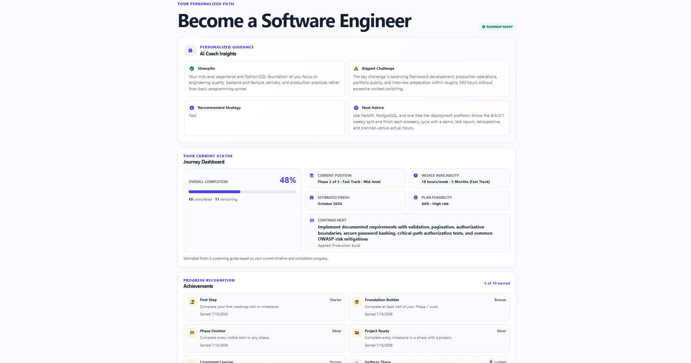

## The problem

Learning advice is often generic, static, and disconnected from execution. Course lists rarely adapt when available time changes, completed work is forgotten, and learners are left without an explanation of why a skill or project matters. Even a strong initial roadmap can become outdated as circumstances change.

## The solution

PathPilot behaves like an adaptive learning coach rather than a one-time roadmap generator. It:

- builds a personalized, phased plan;
- audits feasibility, workload, prerequisites, timeline, and project difficulty;
- revises weak plans before presenting them;
- preserves completed work during strategy changes and replanning;
- explains individual skills, milestones, and recommended projects;
- adapts remaining work when learner constraints change; and
- connects planning to persistent progress, achievements, and next actions.

## Product Tour

### Start with the learner’s goal

PathPilot introduces the product as an adaptive AI learning coach: it plans a path, challenges the draft, and delivers a refined roadmap instead of a generic list of links.

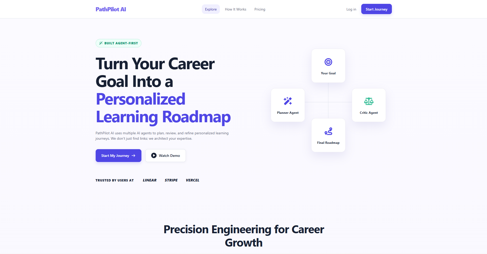

When a valid saved journey exists in the current browser, the Landing page shows its goal, selected strategy, and last-updated date with a **Continue Journey** action. Creating another journey remains available, but PathPilot asks for confirmation before replacing the saved roadmap.

### Create a personalized journey

The learner defines a goal, starting level, timeline, weekly availability, existing skills, and preferred learning style. A live summary makes the constraints clear before generation begins.

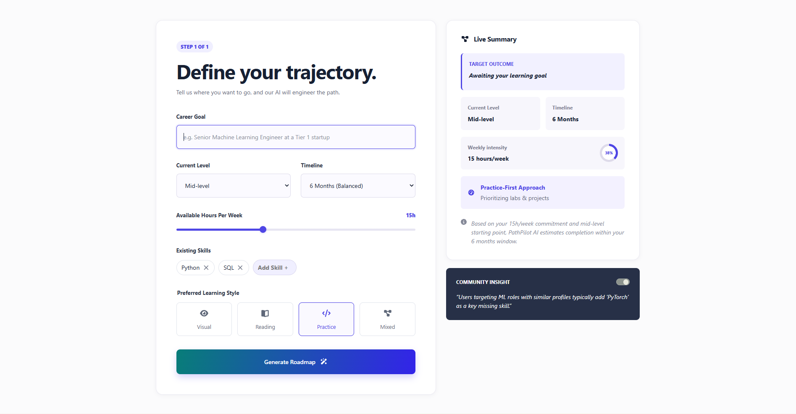

### Planner → Critic → Revision

Initial generation is an explicit sequential workflow: Planner drafts, Critic audits feasibility and prerequisite order, and Revision returns the validated final plan. The Processing page is driven by flushed Server-Sent Events for each real stage start and validated completion; it does not mark stages complete with timers. These are orchestrated request stages, not autonomous background agents.

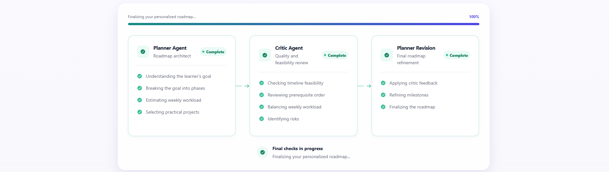

### Roadmap overview, AI Coach, and learner progress

The hero preview above brings the core experience together: personalized AI Coach Insights, current progress, next action, estimated finish, feasibility, and earned achievements. It turns the generated plan into a journey the learner can continue over time.

### Compare Fast, Balanced, and Deep strategies

Learners can compare meaningful trade-offs in speed, workload, depth, risk, confidence, phase content, and project scope. Switching is deterministic and preserves completed-item credit.

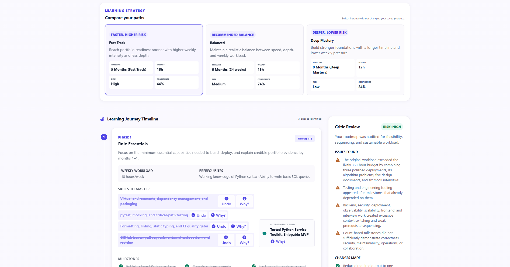

### Understand why each item matters

Explain Why gives contextual reasoning for a selected roadmap item, including its prerequisite role, career impact, and expected benefit, while keeping the roadmap visible.

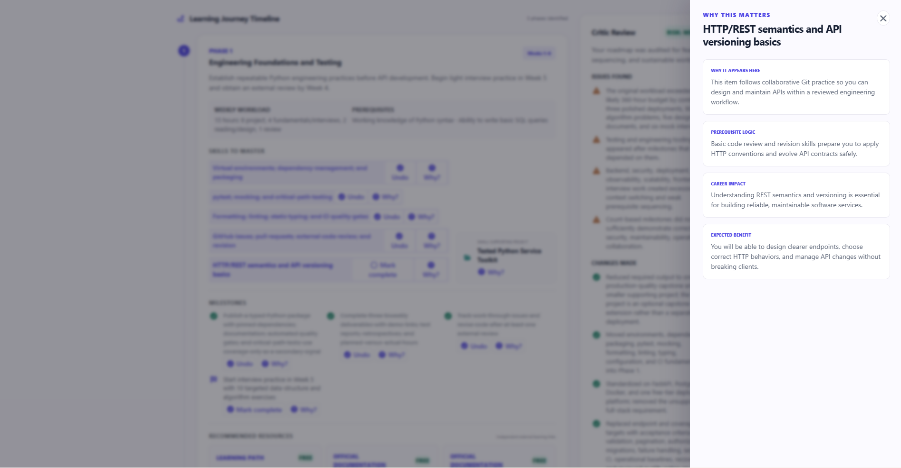

### Adapt without losing completed work

The replan panel captures changed time constraints and learner difficulty while making completed skills and milestones explicit. Completed work remains immutable; only unfinished work is eligible for revision.

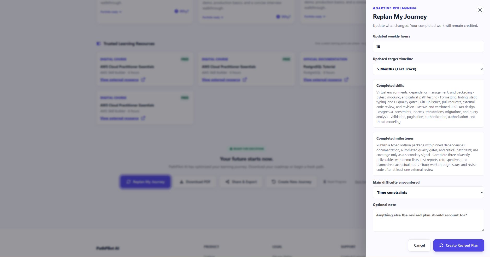

The saved replan result clearly summarizes what changed, why it changed, and the updated workload, timeline, risk, and confidence without resetting progress or strategy selection.

### Learn with trusted resources

Each phase is grounded in a deterministic catalog of reputable providers. Recommendations explain their skill match and strategy fit rather than relying on generated or invented links.

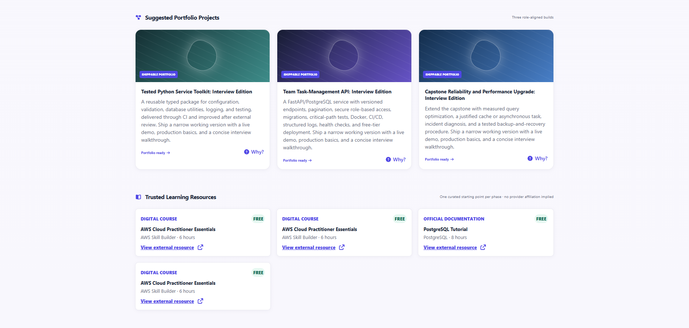

### Export a professional roadmap

PathPilot generates a structured multi-page PDF containing the coach summary, progress, phases, projects, and recommended resources—not a screenshot of the webpage.

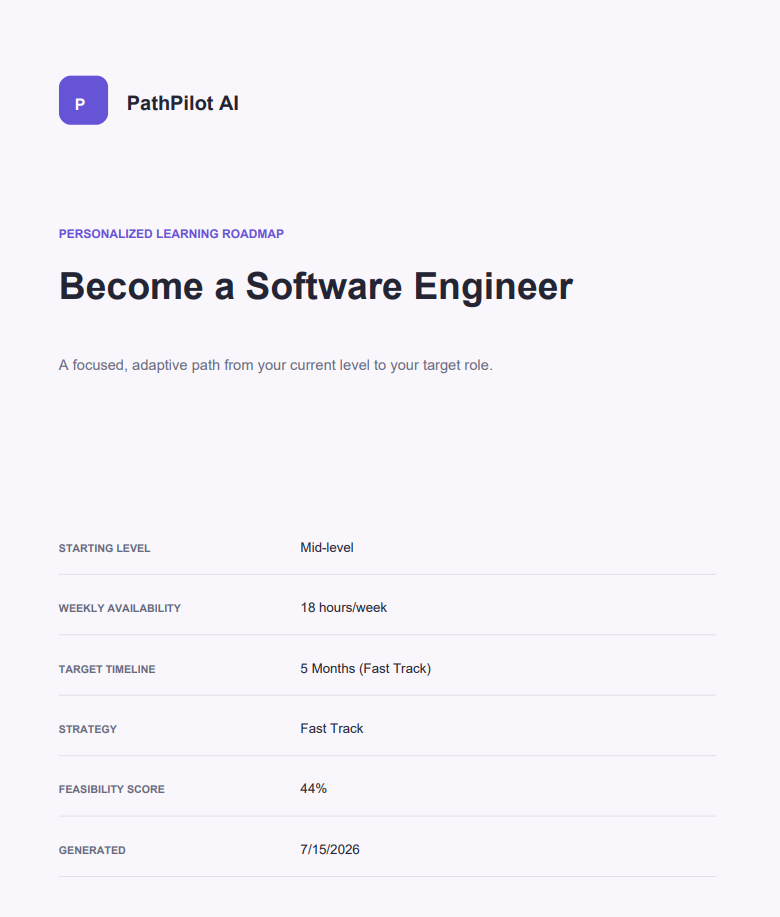

### Share honestly and privately

Share & Export supports a concise summary, safe app link, copied roadmap summary, and PDF download. The UI makes clear that the full roadmap and saved progress remain local to the current browser.

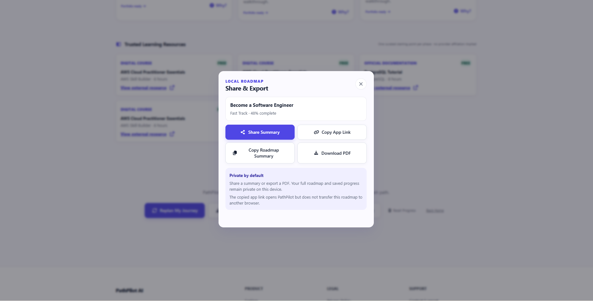

### Responsive on mobile

The same product story and staged AI workflow remain readable on a narrow mobile layout, with touch-friendly actions and no dependency on a desktop-only experience.

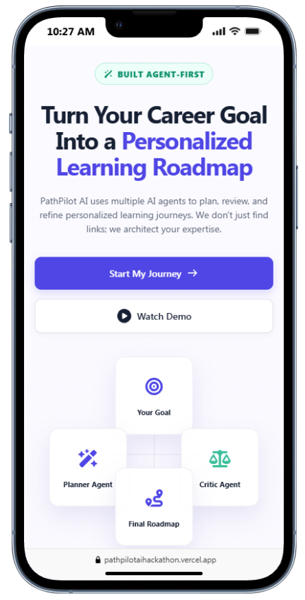

## Core user flow

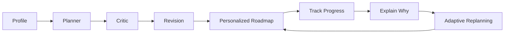

## Key features

- **GPT-5.6 Planner → Critic → Revision** workflow using the OpenAI Responses API
- **Strict Structured Outputs** validated against the existing roadmap schema
- **Personalized AI Coach Insights** generated with the roadmap
- **Alternative Roadmaps:** Fast Track, Balanced, and Deep Mastery
- **Adaptive Replanning** that revises unfinished work while preserving completed items
- **Explain Why** for skills, milestones, phase projects, and suggested portfolio projects
- **Learner Memory** and browser-persistent local progress
- **Continue Journey** with validated direct-route and browser-restart restoration
- **Progress Tracking** with reversible skill and milestone completion
- **Journey Dashboard** with current status, estimated finish, and next action
- **Achievement Badges** derived deterministically from meaningful progress
- **Trusted Resource Recommendations** from a curated local catalog
- **Professional PDF Export** built as a document rather than a page screenshot
- **Share & Export:** Share Summary, Copy App Link, Copy Roadmap Summary, and Download PDF
- **Responsive, accessible UI** with keyboard support, focus management, status announcements, and reduced-motion handling

Share & Export does **not** create a cloud-hosted public roadmap. The app link opens PathPilot, while the full roadmap and saved progress remain local to the current browser.

## What makes PathPilot different

- The roadmap is critic-audited before delivery, rather than returned as an unchecked first response.
- Adaptive Replanning responds to changed time constraints without rerunning the full initial workflow.
- Completed items are immutable during replan validation and remain credited across strategy variants.
- Recommendations can be explained in their local roadmap context.
- Learners can compare explicit speed, depth, workload, risk, and confidence trade-offs.
- Resource suggestions come from a deterministic catalog of trusted providers rather than invented links.
- Progress, next actions, and achievements turn a generated plan into a persistent journey.
- AI is used where judgment adds value; predictable local features remain deterministic and cost-free.

## Architecture

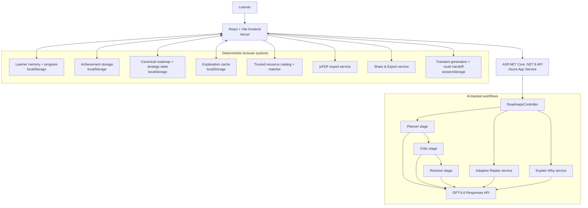

Initial roadmap generation, Adaptive Replanning, and Explain Why are AI-backed. Progress, achievements, strategy derivation, resource matching, PDF export, and Share & Export are deterministic browser features and do not call OpenAI.

The canonical roadmap, selected strategy, strategy-specific replan overrides, learner progress, achievements, and explanation cache are restored from validated `localStorage` records. `sessionStorage` remains in use only for transient generation-attempt and reset markers plus the immediate route-state handoff; it is not the source of browser-restart persistence.

## Multi-agent roadmap workflow

The agents are explicit sequential stages inside one request workflow; they are not autonomous background workers.

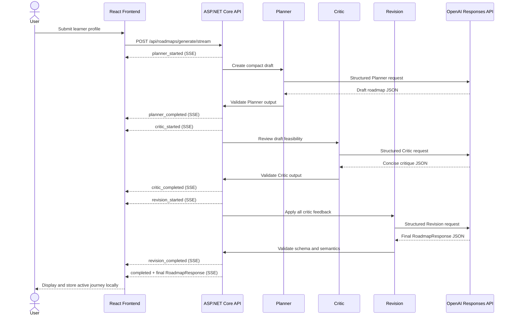

Every SSE event is flushed after it is written. A stage-completed event is emitted only after that stage’s response has passed the required parsing and validation. A failure event identifies the active stage without marking later stages complete.

## Progress, timeouts, and cancellation

- Initial generation uses one guarded SSE request with a 210-second frontend timeout. React StrictMode subscribers share the same in-flight request, and only the visible Retry action starts a fresh attempt.
- The Processing page keeps the current backend stage active and shows a finalizing state after Revision while it waits for the completed roadmap event; it does not invent timer-based completion.
- Adaptive Replanning has an independent 180-second frontend timeout, blocks duplicate submissions, makes no automatic retry, and leaves the current roadmap visible if it fails.
- The backend OpenAI HTTP client uses a 200-second timeout and propagates request cancellation. Confirmed client disconnects stop downstream processing; safe timeout, cancellation, configuration, validation, and upstream-failure details are returned through the applicable SSE failure event or `ProblemDetails` response.

## Adaptive workflow

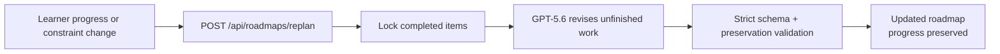

Adaptive Replanning uses one normal GPT-5.6 revision call. It does not rerun Planner, Critic, and Revision, and it does not alter completed-item identity or text.

## Technology stack

### Frontend

- React and JavaScript/JSX
- Vite
- React Router
- Regular CSS
- Font Awesome Free for React
- jsPDF
- Vercel

### Backend and AI

- ASP.NET Core Web API on .NET 8
- OpenAI Responses API
- GPT-5.6
- Strict Structured Outputs
- Azure App Service

### Persistence

- `localStorage` for the canonical saved roadmap, selected strategy, strategy-specific replans, learner memory, progress, achievements, and explanation cache
- Validated roadmap hydration on direct `/roadmap` loads, refreshes, and browser restarts using storage version, journey identity, roadmap structure, and learner-memory matching
- Landing-page **Continue Journey** restoration from the same validated persistence path
- `sessionStorage` only for transient generation attempts, new-journey reset markers, and the immediate roadmap navigation handoff
- No database and no authentication in the MVP

### Validation

- Deterministic frontend tests with Node's test runner
- ESLint
- Vite production build
- .NET restore, build, and Release publish validation

## Production links

- **Frontend:** https://pathpilotaihackathon.vercel.app
- **Backend health:** https://pathpilot-ai-api-2026-agbtbaahced0aff0.centralus-01.azurewebsites.net/health

The health endpoint is independent of OpenAI and returns only service health information.

## Repository structure

```text
PathPilot-AI/
├── frontend/
│   └── path_pilot_AI/          # React + Vite application
├── backend/
│   └── PathPilot_AI/
│       ├── PathPilot_AI.sln
│       └── PathPilot_AI_API/   # ASP.NET Core .NET 8 API
├── docs/
│   ├── ARCHITECTURE.md
│   ├── CODING_RULES.md
│   ├── PROJECT_SPEC.md
│   ├── PROMPTS.md
│   ├── screenshots/
│   └── ui/                     # Original visual references
└── README.md
```

## Local setup

### Frontend

```bash
cd frontend/path_pilot_AI
npm install
```

Create or update `.env`:

```dotenv
VITE_API_BASE_URL=http://localhost:5072
```

Then start Vite:

```bash
npm run dev
```

### Backend

```bash
cd backend/PathPilot_AI/PathPilot_AI_API
dotnet restore
dotnet user-secrets set "OpenAI:ApiKey" "YOUR_API_KEY"
dotnet user-secrets set "OpenAI:Model" "gpt-5.6"
dotnet run --launch-profile http
```

The `UserSecretsId` is configured in the API project. API keys must never be committed to source control.

When the key is absent, Development can use deterministic mock services. Production returns a clear service-unavailable error instead of silently using mock AI.

## Environment variables

### Frontend

| Name                | Development example     | Production example           |
| ------------------- | ----------------------- | ---------------------------- |
| `VITE_API_BASE_URL` | `http://localhost:5072` | Azure App Service API origin |

Share & Export derives the safe app link from the current browser origin and route; no separate public-app URL variable is used.

### Backend

| Azure/App Setting        | Purpose                        | Example                                   |
| ------------------------ | ------------------------------ | ----------------------------------------- |
| `OpenAI__ApiKey`         | Backend-only OpenAI credential | `YOUR_API_KEY`                            |
| `OpenAI__Model`          | Required model name            | `gpt-5.6`                                 |
| `AllowedOrigins__0`      | First allowed frontend origin  | `https://pathpilotaihackathon.vercel.app` |
| `ASPNETCORE_ENVIRONMENT` | Runtime environment            | `Production`                              |

Additional origins can use `AllowedOrigins__1`, `AllowedOrigins__2`, and so on. Never commit real credentials.

## Testing and build commands

Frontend commands run from `frontend/path_pilot_AI`:

```bash
npm run lint
npm run build
npm test
```

Backend commands run from `backend/PathPilot_AI`:

```bash
dotnet restore
dotnet build
dotnet publish -c Release
```

## Security and privacy

- The OpenAI API key is backend-only and read from User Secrets or environment configuration.
- Learner roadmaps, progress, achievements, strategy state, and cached explanations are stored locally in the browser.
- Copied URLs contain no learner profile or roadmap content.
- Copy App Link opens PathPilot but does not transfer the roadmap to another browser.
- Share Summary and Copy Roadmap Summary happen only after a user action.
- Development diagnostics exclude API keys, full prompts, full learner data, and full model output.
- Public API failures use safe `ProblemDetails` responses without production stack traces.
- Production does not silently fall back to mock AI when configuration is missing.

## Cost-conscious AI design

- Strict output schemas constrain every AI response.
- Compact, stage-specific prompts request only required fields.
- Reasoning effort is set to `none` where supported by the implemented workflows.
- Progress, achievements, strategy variants, resource matching, PDF export, and Share & Export make no AI calls.
- Explain Why results are cached by journey and stable item ID.
- Duplicate generation and replan submissions are guarded in the frontend.
- Adaptive Replanning uses one normal request rather than rerunning the initial three stages.
- Each initial Planner, Critic, or Revision stage allows at most one retry for eligible incomplete output, invalid JSON, or structured-output validation failures.
- Cancellation, refusal, authentication, billing, quota, rate-limit, and other non-retryable failures do not trigger another AI request. Adaptive Replanning and frontend requests are not retried automatically.

## Current Limitations

- Roadmaps, learner progress, strategy selection, and related journey state are currently stored in the user's browser using `localStorage`.
- Saved data persists across refreshes and browser restarts on the same browser and device.
- Journey data does not currently synchronize across browsers or devices.
- Clearing browser storage, using private browsing, changing domains, or switching devices may make saved journey data unavailable.
- PathPilot does not currently require user accounts or use cloud storage for learner journeys.
- PDF export is a human-readable document only; it cannot restore roadmap or progress state.

## Future Improvements

- Optional account-based synchronization
- Multi-device access
- Portable journey backup and restore using structured JSON
- Cloud persistence with user-controlled privacy settings
- Improved collaboration and sharing controls

## Built for OpenAI Build Week

PathPilot AI was built for OpenAI Build Week using GPT-5.6 through the Responses API and Codex-assisted development. Its initial AI workflow is Planner → Critic → Revision. Adaptive Replanning and Explain Why are separate, focused AI workflows.

Deterministic frontend systems complement the AI: learner memory, progress, achievements, strategy variants, trusted-resource matching, PDF export, and Share & Export. This separation keeps predictable features fast, private, and cost-conscious without overstating the system as an autonomous agent fleet.

## Project status

- Frontend deployed on Vercel
- Backend deployed on Azure App Service
- Production flow smoke-tested
- Local-only persistence retained as an intentional hackathon MVP limitation

PathPilot provides planning guidance and does not guarantee employment, certification, or learning outcomes.
