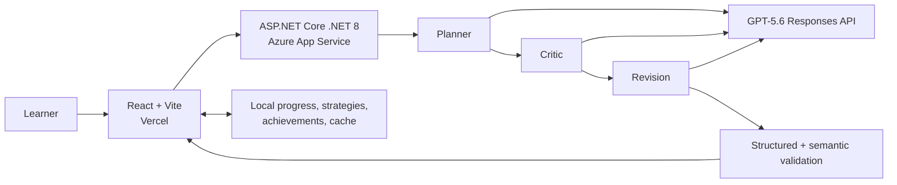

# PathPilot AI — Judge Quick Guide

> **An adaptive AI learning coach that plans, explains, tracks, and revises a personalized journey.**

## Problem

Most learning plans are generic and static. They often ignore starting level, prerequisite order, weekly availability, and project readiness. When circumstances change, learners must start over or lose credit for completed work. Recommendations also rarely explain why an item matters.

## Solution

PathPilot converts a learner profile into a critic-audited roadmap, then supports the journey after generation. It combines focused GPT-5.6 workflows with deterministic local systems for progress, strategies, achievements, trusted resources, PDF export, and privacy-conscious sharing.

## Architecture



Planner, Critic, and Revision are sequential, orchestrated stages—not fully autonomous agents. Adaptive Replanning and Explain Why are separate focused AI calls. Stable product behavior remains deterministic in the browser.

## Differentiators

- **Critic before delivery:** feasibility, workload, prerequisites, timeline, missing skills, and project difficulty are reviewed before the roadmap is shown.
- **Strict Structured Outputs:** model results are constrained and validated for JSON shape, schema, semantics, and risk-score consistency.
- **Immutable completed progress:** replanning cannot silently remove, move, or rewrite completed skills and milestones.
- **Explainable recommendations:** learners can ask why a skill, milestone, project, or phase appears.
- **Real strategy trade-offs:** Fast Track, Balanced, and Deep Mastery change educational substance, workload, timeline, risk, and project depth.
- **Trusted resource grounding:** recommendations come from a deterministic catalog of reputable providers rather than generated URLs.
- **AI where judgment matters:** calculations, persistence, achievements, resources, strategy derivation, PDF, and sharing remain local and cost-conscious.

## Feature highlights

- Planner → Critic → Revision initial workflow
- AI Coach Insights generated with the roadmap
- Adaptive Replanning using one focused revision call
- Persistent local progress and current-phase tracking
- Journey Dashboard, next action, estimated finish, and achievement badges
- Fast Track, Balanced, and Deep Mastery comparison
- Explain Why with journey-specific caching
- Trusted learning resources per phase
- Accessible interactions and responsive design
- Professional multi-page PDF export and honest Share & Export controls

## Deployment links

- **Live frontend:** https://pathpilotaihackathon.vercel.app
- **Backend health:** https://pathpilot-ai-api-2026-agbtbaahced0aff0.centralus-01.azurewebsites.net/health

The frontend is deployed on Vercel. The ASP.NET Core API is deployed on Azure App Service. The health endpoint does not call OpenAI.

## Repository map

```text
frontend/path_pilot_AI/               React, Vite, JavaScript/JSX, regular CSS
backend/PathPilot_AI/PathPilot_AI_API ASP.NET Core .NET 8 API and AI services
docs/                                 Product, architecture, demo, and submission docs
README.md                             Full setup, configuration, and architecture guide
```

## Recommended judging flow

**Suggested time: 3–5 minutes**

1. **Create Journey:** review the learner inputs and submit a prepared profile.
2. **Processing:** observe Planner → Critic → Revision. If hosted generation is slow, use the prepared completed roadmap.
3. **Roadmap header:** inspect feasibility, risk, critic review, and AI Coach Insights.
4. **Journey Dashboard:** review progress, current phase, next action, estimated finish, and achievements.
5. **Compare strategies:** switch among Fast Track, Balanced, and Deep Mastery and observe substantive roadmap changes.
6. **Explain Why:** open one skill or milestone explanation.
7. **Trusted Resources:** inspect provider, type, matching reason, and external link.
8. **Progress integrity:** mark an item complete, then open Adaptive Replanning and confirm completed work remains credited.
9. **Export:** show the professional PDF and privacy-conscious sharing options.

## Important MVP boundaries

- Progress and roadmaps are stored locally in the current browser; there is no account or cloud synchronization.
- Copy App Link opens PathPilot but does not transfer the roadmap to another browser.
- Estimated finish dates are planning guidance, not guarantees.
- PathPilot does not guarantee employment, certification, or learning outcomes.
